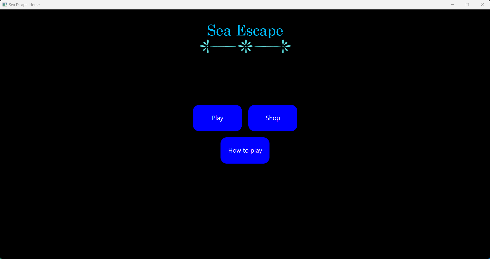
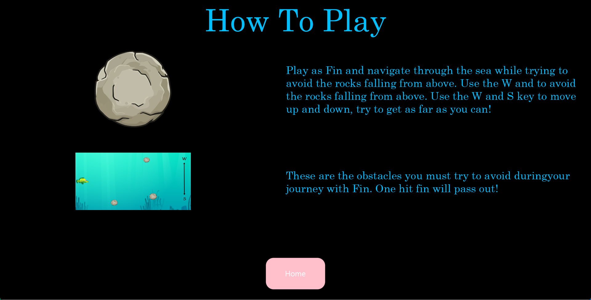
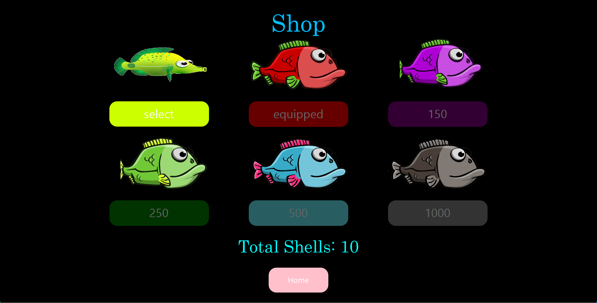
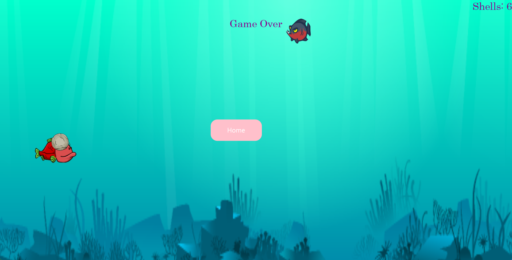

# Sea Escape

## Team Members
- **Dylan Patel**
- **Nicolas Pacheco**

## Introduction
**Sea Escape** is an engaging game inspired by **Flappy Bird** and **Jetpack Joyride**. Players control Fin, navigating through falling rocks by pressing the **W** and **S** keys to move up and down. This project serves as our final assignment, where we aimed to transform our creative ideas into reality. A notable feature is the shop functionality, enabling players to customize Fin for an enhanced gaming experience.

## Design
Our project is organized into multiple classes and four distinct packages, each with a specific function. To ensure clarity, we have commented on sections of the code that could potentially cause confusion. We utilized various resources, including **Stack Overflow**, **Oracle documentation**, and **JavaFX syntax**, with **Eclipse** as our Integrated Development Environment (IDE) to visually assess our code structure. By covering essential topics from our course, we ensured the efficiency and functionality of our code.

## Instructions
To run **Sea Escape**, follow these steps:

1. Clone this repository to your local machine.
2. Import the project into your Eclipse IDE.
3. Run `Main.java` as a Java application.

### Troubleshooting
If you encounter errors after importing, please do the following:
- Right-click the project in Eclipse.
- Navigate to **Properties** > **Java Build Path** > **Libraries**.
- Click on **Add External JARs** and import the required JAR files from the **javafx-sdk-17.0.6** library located in the **lib** folder (see the screenshot below).

After completing these steps, click the **"How to Play"** button in the game to access instructions and learn about the game's objectives.

### System Requirements
- Any desktop or laptop capable of running Eclipse.

## Conclusion
**Sea Escape** represents our dedication and effort within the project timeframe. Throughout this experience, we developed vital skills in time management, JavaFX syntax, problem-solving, teamwork, and communication. Future enhancements may include adding various obstacles, a distance traveled meter, and power-ups that randomly spawn during gameplay.

## Screenshots
  
  
  
  

